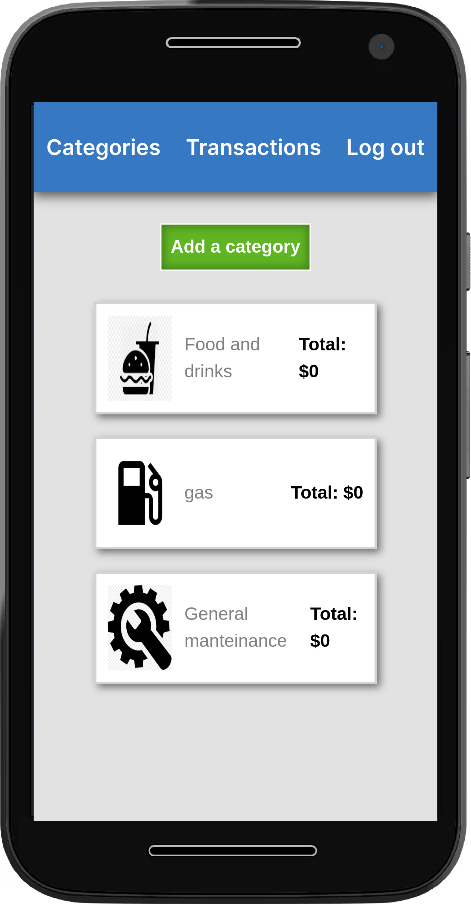

# Accounting King :crown:

> This web app to keep track of your expenses! :smiley:

This web app allows you to keep track of your expenses by letting you create categories in your account, where you can then add transactions and their dates.

## Built With: 🔍

- Ruby
- Rails
- JavaScript
- Html
- Css
- Heroku

## Live Demo: 📄
- [Video guide](https://www.loom.com/share/1fdd5ae82b504340850e1023772d7492)

- [Accounting King](https://accountingking.herokuapp.com/)

## Getting Started

 To get a local copy up and running follow these simple example steps.
- git clone  `https://github.com/Kakalanp/accounting-king.git`

- change to the directory using `cd accounting-king`

- open with your preffered code editor.

### Prerequisites: 🤓

- Ruby
- Rails
- Postgresql

### Setup: ⚙️

- Start by opening the project using `cd accounting-king`

- Run `bundle i`

- Then `rails db:create`

- Followed by `rails db:migrate`

- You're now ready to run the server with `rails s`

## Author: 👋

### 👤 Joaquin G.L. Zanetti
- GitHub: [@Kakalanp](https://github.com/Kakalanp)
- Twitter: [@LeccaJoaquin](https://twitter.com/LeccaJoaquin)
- LinkedIn: [Joaquín Garrido Lecca Zanetti](https://www.linkedin.com/in/joaquin-garrido-lecca-zanetti/)

## Contributing: 🤝

Contributions, issues, and feature requests are welcome!

Feel free to check the [issues page](../../issues/).

## Show your support: 🌟

Give a ⭐️ if you like this project!

## Acknowledgments: 📝

- Hat tip to anyone whose code was used
- Inspiration
- etc

## License: :monocle_face:

This project is [MIT](./LICENSE) licensed.
